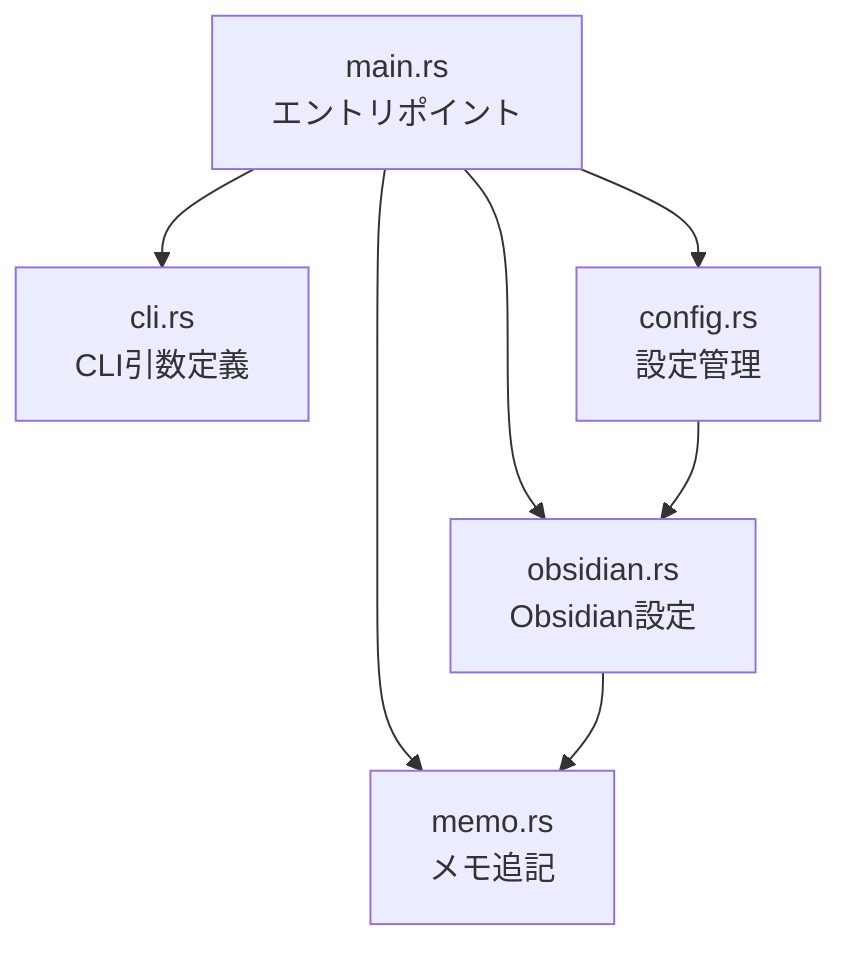

# Design Document

## Overview

thn CLIプロジェクトの初期環境構築。Rustプロジェクトの初期化、依存クレート設定、モジュール構造の作成を行う。

## Steering Document Alignment

### Technical Standards (tech.md)
- Rust (stable) を使用
- cargo をビルド・パッケージ管理に使用
- clap 4 (derive) でCLI引数定義
- serde + serde_json + toml で設定ファイル処理

### Project Structure (structure.md)
- `src/` 配下にモジュールを配置
- snake_case でファイル名を命名
- 各モジュールは単一責務

## Code Reuse Analysis

新規プロジェクトのため、既存コードの再利用はなし。

### Integration Points
- ファイルシステム: 設定ファイル読み書き
- Obsidian Vault: 設定読み取り（将来の機能で使用）

## Architecture



### Modular Design Principles
- **Single File Responsibility**: 各モジュールは1つの機能に集中
- **Component Isolation**: cli, config, obsidian, memo を独立して開発可能
- **Clear Interfaces**: pub 関数でモジュール間のインターフェースを定義

## Components and Interfaces

### main.rs
- **Purpose:** エントリポイント、CLIディスパッチ
- **Interfaces:** `fn main()`
- **Dependencies:** cli, config, obsidian, memo

### cli.rs
- **Purpose:** clapによるCLI引数定義
- **Interfaces:**
  - `struct Cli` - 引数構造体
  - `enum Commands` - サブコマンド定義
- **Dependencies:** clap

### config.rs
- **Purpose:** thn設定ファイル管理
- **Interfaces:**
  - `struct Config` - 設定構造体
  - `fn load() -> Result<Config>` - 設定読み込み
  - `fn save(&self) -> Result<()>` - 設定保存
  - `fn config_path() -> PathBuf` - 設定ファイルパス
- **Dependencies:** serde, toml, dirs

### obsidian.rs
- **Purpose:** Obsidian設定読み取り
- **Interfaces:**
  - `struct DailyNotesSettings` - デイリーノート設定
  - `struct ThioSettings` - Thino設定
  - `fn load_daily_notes_settings(vault: &Path) -> DailyNotesSettings`
  - `fn load_thino_settings(vault: &Path) -> ThinoSettings`
- **Dependencies:** serde_json

### memo.rs
- **Purpose:** メモ追記ロジック
- **Interfaces:**
  - `fn append_memo(config: &Config, content: &str) -> Result<()>`
- **Dependencies:** chrono, config, obsidian

## Data Models

### Config
```rust
#[derive(Serialize, Deserialize)]
pub struct Config {
    pub vault_path: PathBuf,
}
```

### Cli
```rust
#[derive(Parser)]
#[command(name = "thn", version, about)]
pub struct Cli {
    #[command(subcommand)]
    pub command: Option<Commands>,

    /// メモ内容
    pub memo: Option<String>,
}

#[derive(Subcommand)]
pub enum Commands {
    Init { path: Option<PathBuf> },
    Config,
}
```

## Error Handling

### Error Scenarios
1. **設定ファイルなし**
   - **Handling:** エラーメッセージ表示、`thn --init [<PATH>]` を促す
   - **User Impact:** `error: not configured. run 'thn --init [<PATH>]' first`

2. **Vault不在**
   - **Handling:** パス検証でエラー
   - **User Impact:** `error: vault not found: {path}`

## Testing Strategy

### Unit Testing
- 各モジュールに `#[cfg(test)]` モジュールを配置
- config, obsidian のパース処理をテスト

### Integration Testing
- `tests/` ディレクトリに統合テストを配置
- CLI引数のパーステスト

### End-to-End Testing
- 実際のVaultを使ったメモ追記テスト（手動）
