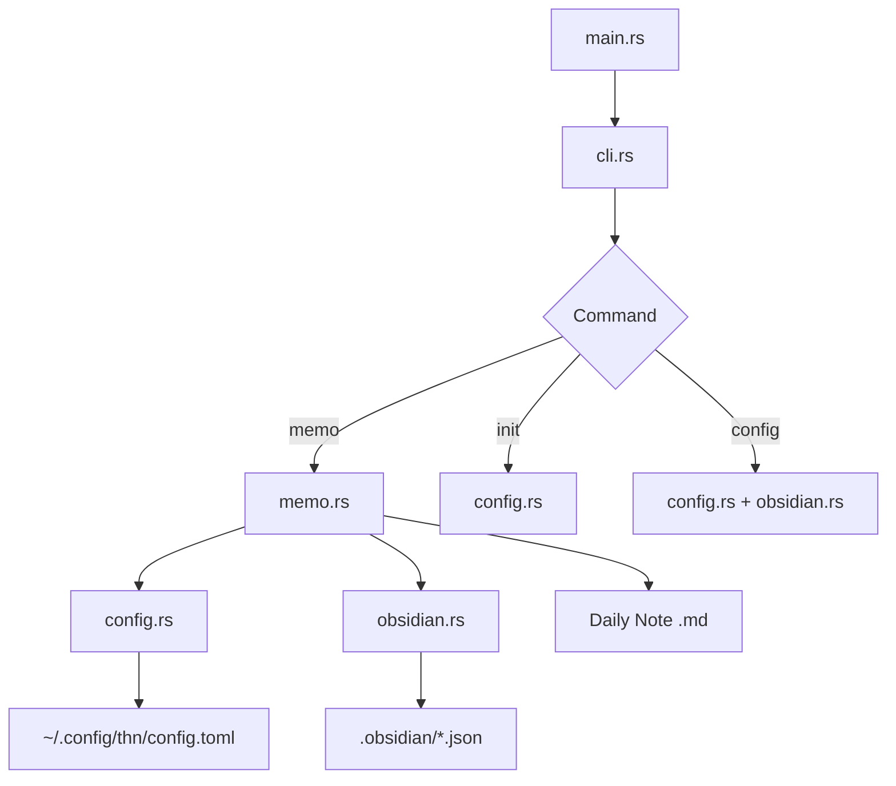

# Design Document

## Overview

thn CLIのコア機能実装。既存のモジュール構造（cli.rs, config.rs, obsidian.rs, memo.rs）を活用し、メモ追記、初期設定、設定表示の機能を実装する。

## Steering Document Alignment

### Technical Standards (tech.md)
- Rust stable、clap 4 (derive)によるCLI定義
- serde/serde_json/tomlによる設定ファイル読み書き
- chronoによる日付処理
- Result型によるエラー伝播

### Project Structure (structure.md)
- `src/main.rs`: エントリポイント、CLIディスパッチ
- `src/cli.rs`: clap定義
- `src/config.rs`: thn設定管理
- `src/obsidian.rs`: Obsidian設定読み取り
- `src/memo.rs`: メモ追記ロジック

## Code Reuse Analysis

### Existing Components to Leverage
- **cli.rs**: 既存のClap構造体を拡張（initサブコマンドのオプション引数対応）
- **config.rs**: Config構造体とload/save関数
- **obsidian.rs**: DailyNotesSettings, ThinoSettings構造体

### Integration Points
- **ファイルシステム**: std::fs による読み書き
- **設定ファイル**: `~/.config/thn/config.toml`
- **Obsidian設定**: `.obsidian/daily-notes.json`, `.obsidian/plugins/obsidian-memos/data.json`

## Architecture



### Modular Design Principles
- **Single File Responsibility**: 各モジュールは単一責務
- **Component Isolation**: config/obsidian/memoは独立してテスト可能
- **Service Layer Separation**: CLI層、設定層、ビジネスロジック層を分離
- **Utility Modularity**: 日付フォーマット変換はobsidian.rsに集約

## Components and Interfaces

### cli.rs
- **Purpose:** CLI引数定義、サブコマンド解析
- **Interfaces:**
  ```rust
  pub struct Cli {
      pub memo: Option<String>,
      pub command: Option<Commands>,
  }
  pub enum Commands {
      Init { path: Option<PathBuf> },
      Config,
  }
  ```
- **Dependencies:** clap
- **Reuses:** 既存のCli構造体を拡張

### config.rs
- **Purpose:** thn設定ファイルの読み書き
- **Interfaces:**
  ```rust
  pub struct Config {
      pub vault_path: PathBuf,
  }
  impl Config {
      pub fn load() -> Result<Self, ConfigError>;
      pub fn save(&self) -> Result<(), ConfigError>;
      pub fn config_path() -> PathBuf;
  }
  pub fn prompt_vault_path() -> Result<PathBuf, io::Error>;
  ```
- **Dependencies:** serde, toml, dirs
- **Reuses:** 既存のConfig構造体

### obsidian.rs
- **Purpose:** Obsidian設定ファイル読み取り
- **Interfaces:**
  ```rust
  pub struct DailyNotesSettings {
      pub folder: String,
      pub format: String,
  }
  pub struct ThinoSettings {
      pub insert_after: String,
  }
  impl DailyNotesSettings {
      pub fn load(vault_path: &Path) -> Self;
  }
  impl ThinoSettings {
      pub fn load(vault_path: &Path) -> Self;
  }
  pub fn format_date(format: &str, date: NaiveDate) -> String;
  ```
- **Dependencies:** serde, serde_json, chrono
- **Reuses:** 既存の設定構造体

### memo.rs
- **Purpose:** メモ追記ロジック
- **Interfaces:**
  ```rust
  pub fn append_memo(
      vault_path: &Path,
      daily_settings: &DailyNotesSettings,
      thino_settings: &ThinoSettings,
      content: &str,
  ) -> Result<(), MemoError>;

  fn find_insert_position(content: &str, insert_after: &str) -> usize;
  fn format_memo_line(content: &str) -> String;
  fn ensure_daily_note(path: &Path, insert_after: &str) -> Result<(), io::Error>;
  ```
- **Dependencies:** chrono, std::fs
- **Reuses:** 新規実装

## Data Models

### Config (config.rs)
```rust
#[derive(Debug, Serialize, Deserialize)]
pub struct Config {
    pub vault_path: PathBuf,
}
```

### DailyNotesSettings (obsidian.rs)
```rust
#[derive(Debug, Deserialize, Default)]
pub struct DailyNotesSettings {
    #[serde(default)]
    pub folder: String,          // デフォルト: ""
    #[serde(default = "default_format")]
    pub format: String,          // デフォルト: "YYYY-MM-DD"
}
```

### ThinoSettings (obsidian.rs)
```rust
#[derive(Debug, Deserialize, Default)]
pub struct ThinoSettings {
    #[serde(rename = "InsertAfter", default)]
    pub insert_after: String,    // デフォルト: ""
}
```

## Error Handling

### Error Scenarios
1. **設定ファイル未作成**
   - **Handling:** ConfigError::NotConfigured を返す
   - **User Impact:** `error: not configured. run 'thn init' first`

2. **Vaultパス不正**
   - **Handling:** ConfigError::VaultNotFound を返す
   - **User Impact:** `error: vault not found: {path}`

3. **Obsidian Vaultではない**
   - **Handling:** ConfigError::NotObsidianVault を返す
   - **User Impact:** `error: not an obsidian vault: {path}`

4. **ファイル書き込み失敗**
   - **Handling:** MemoError::WriteFailed を返す
   - **User Impact:** `error: failed to write: {path}`

5. **メモ内容未指定**
   - **Handling:** CLI層でバリデーション
   - **User Impact:** `error: memo content required`

### Error Types
```rust
// config.rs
pub enum ConfigError {
    NotConfigured,
    VaultNotFound(PathBuf),
    NotObsidianVault(PathBuf),
    IoError(io::Error),
    ParseError(toml::de::Error),
}

// memo.rs
pub enum MemoError {
    ConfigError(ConfigError),
    WriteFailed(PathBuf, io::Error),
}
```

## Testing Strategy

### Unit Testing
- **config.rs**: load/save のシリアライズ/デシリアライズ
- **obsidian.rs**: 設定ファイルパース、日付フォーマット変換
- **memo.rs**: InsertAfter位置検索、メモ行生成

### Integration Testing
- 一時ディレクトリでVault構造を作成
- init → memo → config の一連フローをテスト
- 各種エラーケースの確認

### End-to-End Testing
- 実際のコマンド実行（`cargo run -- "test"`）
- 終了コード確認
- ファイル内容確認
