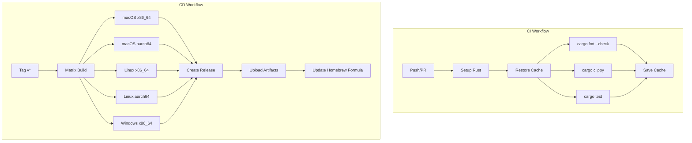

# Design Document: CI/CD

## Overview

GitHub Actionsを使用したCI/CDパイプラインを構築する。CIワークフローはPR/プッシュ時にテスト・リント・ビルドを実行し、CDワークフローはリリースタグ作成時にクロスプラットフォームバイナリをビルドしてGitHub Releasesに公開する。

## Steering Document Alignment

### Technical Standards (tech.md)
- **Code Quality Tools**: `cargo clippy`、`cargo fmt`をCIで自動実行
- **Testing Framework**: `cargo test`をCIで自動実行
- **VCS**: GitHub Flow（main + feature branches）に従ったワークフロートリガー
- **Distribution Method**: GitHub Releasesへのバイナリ公開

### Project Structure (structure.md)
- `.github/workflows/` にワークフローファイルを配置
- CIとCDを分離した2つのワークフローファイル

## Code Reuse Analysis

### Existing Components to Leverage
- **Cargo.toml**: 依存関係定義、キャッシュキー生成に使用
- **Cargo.lock**: 依存関係の固定、キャッシュキー生成に使用

### Integration Points
- **GitHub API**: PRステータスチェック、Releases作成
- **crates.io**: 依存関係のダウンロード

## Architecture



## Homebrew配布

### 概要
Homebrewでのインストールを可能にするため、Tapリポジトリを使用した配布を行う。

### 必要なリポジトリ構成
```
ignission/thn           # メインリポジトリ（本プロジェクト）
ignission/homebrew-tap  # Homebrew Tapリポジトリ（別途作成）
```

### Homebrew Tapリポジトリ構成
```
homebrew-tap/
└── Formula/
    └── thn.rb          # Formulaファイル
```

### Formula テンプレート (`thn.rb`)
```ruby
class Thn < Formula
  desc "CLI tool for appending memos to Obsidian daily notes (Thino compatible)"
  homepage "https://github.com/ignission/thn"
  version "VERSION"
  license "MIT"

  on_macos do
    on_arm do
      url "https://github.com/ignission/thn/releases/download/vVERSION/thn-VERSION-aarch64-apple-darwin.tar.gz"
      sha256 "SHA256_ARM"
    end
    on_intel do
      url "https://github.com/ignission/thn/releases/download/vVERSION/thn-VERSION-x86_64-apple-darwin.tar.gz"
      sha256 "SHA256_INTEL"
    end
  end

  on_linux do
    on_arm do
      url "https://github.com/ignission/thn/releases/download/vVERSION/thn-VERSION-aarch64-unknown-linux-gnu.tar.gz"
      sha256 "SHA256_LINUX_ARM"
    end
    on_intel do
      url "https://github.com/ignission/thn/releases/download/vVERSION/thn-VERSION-x86_64-unknown-linux-gnu.tar.gz"
      sha256 "SHA256_LINUX_INTEL"
    end
  end

  def install
    bin.install "thn"
  end

  test do
    system "#{bin}/thn", "--version"
  end
end
```

### 自動更新フロー
1. リリースタグ作成 → バイナリビルド → GitHub Releases公開
2. 各バイナリのSHA256ハッシュを計算
3. Formulaファイルを更新（バージョン、URL、SHA256）
4. homebrew-tapリポジトリにコミット・プッシュ

### インストール方法（ユーザー向け）
```bash
brew tap ignission/tap
brew install thn
```

## Components and Interfaces

### CI Workflow (`ci.yml`)
- **Purpose**: コード品質チェックとテスト実行
- **Triggers**:
  - `push` to `main`
  - `pull_request` to `main`
- **Jobs**:
  - `check`: fmt, clippy, test を並列実行
- **Reuses**: actions/checkout, dtolnay/rust-toolchain, Swatinem/rust-cache

### CD Workflow (`release.yml`)
- **Purpose**: クロスプラットフォームバイナリのビルドとリリース
- **Triggers**:
  - `push` tags `v*`
- **Jobs**:
  - `build`: マトリックスビルド（5ターゲット）
  - `release`: GitHub Release作成とアーティファクト添付
- **Reuses**: actions/checkout, dtolnay/rust-toolchain, softprops/action-gh-release

## Data Models

### Build Matrix
```yaml
matrix:
  include:
    - target: x86_64-apple-darwin
      os: macos-latest
    - target: aarch64-apple-darwin
      os: macos-latest
    - target: x86_64-unknown-linux-gnu
      os: ubuntu-latest
    - target: aarch64-unknown-linux-gnu
      os: ubuntu-latest
    - target: x86_64-pc-windows-msvc
      os: windows-latest
```

### Release Artifact Naming
```
thn-{version}-{target}.tar.gz  (Unix)
thn-{version}-{target}.zip     (Windows)
```

## Error Handling

### Error Scenarios
1. **テスト失敗**
   - **Handling**: ワークフロー失敗、PRマージブロック
   - **User Impact**: GitHub UIで失敗箇所を確認可能

2. **クロスコンパイル失敗**
   - **Handling**: 該当ターゲットのみ失敗、他は継続
   - **User Impact**: 失敗したターゲットはリリースに含まれない

3. **キャッシュミス**
   - **Handling**: フルビルド実行（遅延のみ、失敗ではない）
   - **User Impact**: ビルド時間が長くなる

## Testing Strategy

### Unit Testing
- ワークフロー自体のテストは不要（GitHub Actionsが担保）
- 既存の`cargo test`がCIで実行される

### Integration Testing
- PRを作成してCIが正常に動作することを確認
- テストタグをプッシュしてCDワークフローを検証

### End-to-End Testing
- リリースタグ作成後、GitHub Releasesにバイナリが公開されることを確認
- 各プラットフォームでダウンロードしたバイナリが動作することを手動確認

## Security Considerations

### Permissions
```yaml
permissions:
  contents: write  # Release作成に必要
```

### Action Pinning
- サードパーティアクションはコミットSHAでピン留め
- 例: `actions/checkout@v4` → `actions/checkout@b4ffde65f46336ab88eb53be808477a3936bae11`
